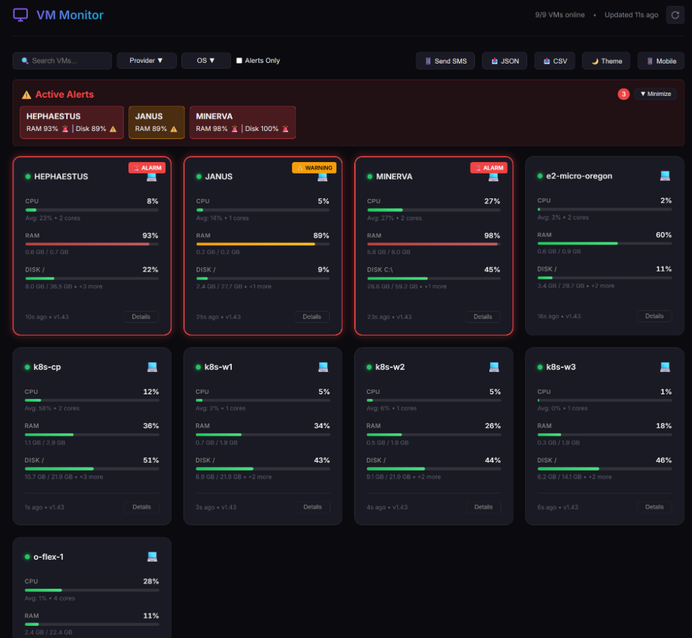
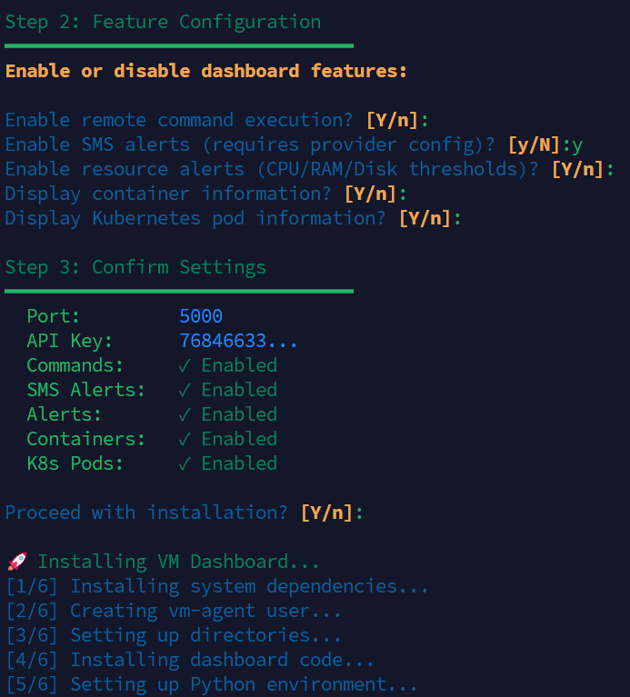
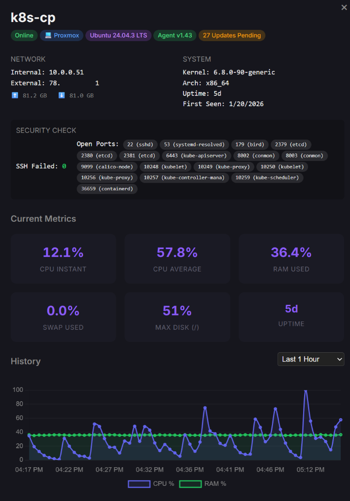
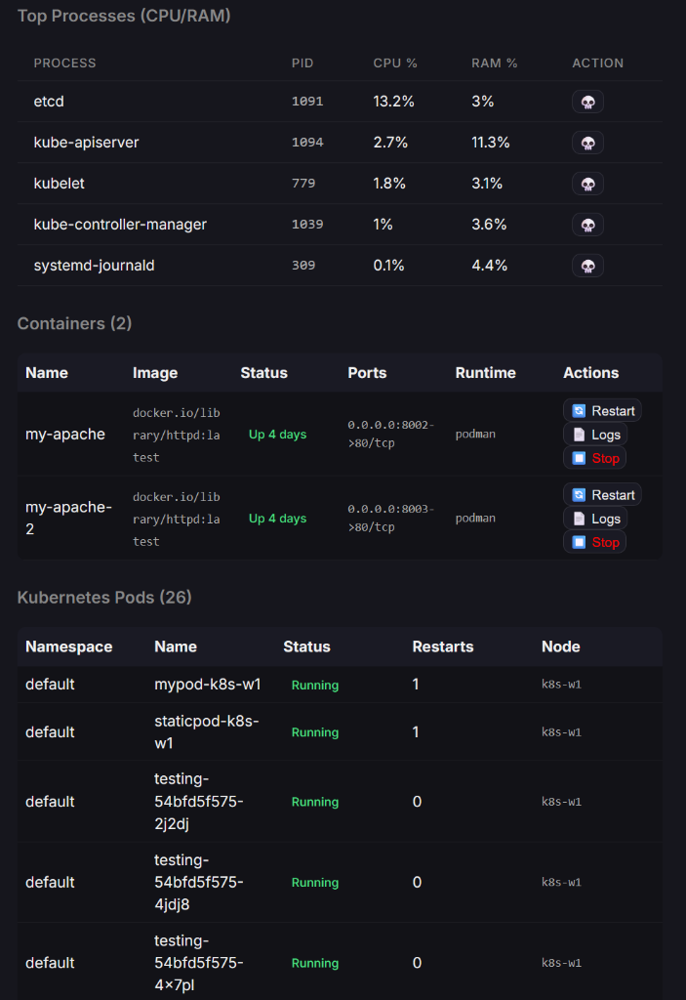
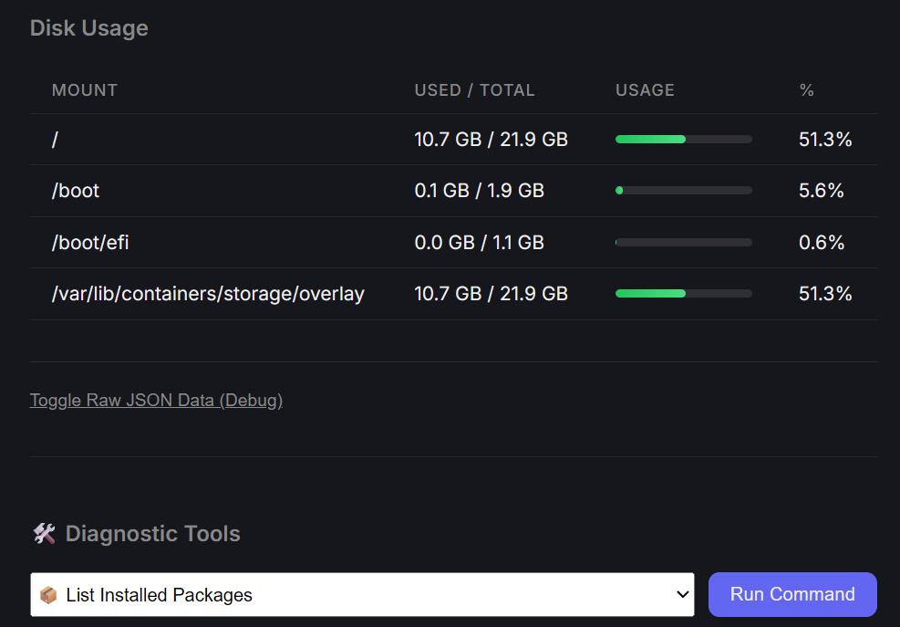
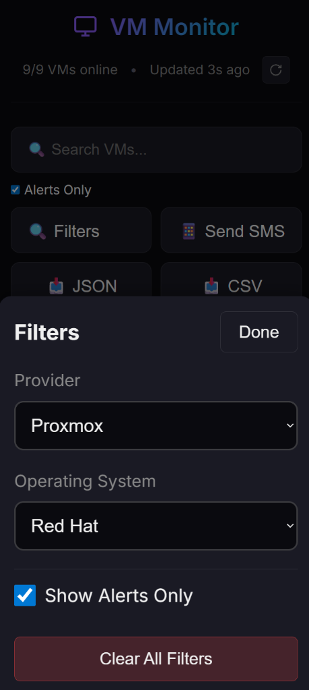
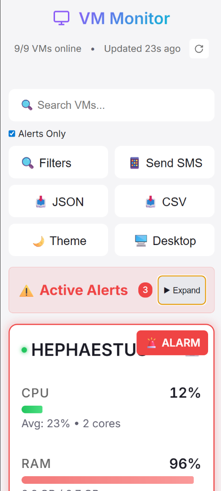

# 🖥️ VM Monitor

<div align="center">

**The lightweight, self-hosted VM monitoring system that just works.**

[](LICENSE)
[](https://python.org)
[](#multi-platform-agent)
[](https://monitordemo.aydin.cloud)

[Features](#-features) • [Quick Start](#-quick-start) • [Why VM Monitor?](#-why-vm-monitor) • [Live Demo](https://monitordemo.aydin.cloud)

---

📢 **This project is in active development.** The name "VM Monitor" is a working title and may change. New versions might occasionally break things, but it's fully offline and self-contained. Contributions, feedback, and critiques are very welcome!

</div>

---

## 🎯 The Problem

You have VMs scattered across AWS, GCP, Oracle Cloud, and your homelab. You want to:
- See all their health at a glance
- Get Telegram/SMS alerts when something's wrong
- Restart services or reboot machines remotely
- **Without** deploying a 10-component Prometheus/Grafana stack
- **Without** paying $15/host/month for Datadog

## ✅ The Solution

VM Monitor is a **single Python file** agent + **single Flask app** dashboard. Install in 2 minutes, monitor and manage forever.

- **Monitor**: CPU, RAM, Disk, Swap, Network I/O, containers, pods—all in real-time
- **Manage**: Restart services, reboot VMs, patch OS, kill runaway processes—all from your browser
- **Alert**: Telegram or SMS notifications when thresholds breach, scheduled or on-demand

> **Platform-Agnostic**: Runs anywhere Python runs. No compiled binaries, no OS-specific dependencies. Pre-built wheels included for offline installation.



---

## ⚡ Quick Start

### 1. Deploy Dashboard (2 min)

```bash
git clone https://github.com/aydinguven/vm-monitor.git
cd vm-monitor && ./scripts/setup_dashboard.sh
```

**Or with Docker:**
```bash
docker run -d -p 5000:5000 \
  -v vm-monitor-data:/app/instance \
  ghcr.io/aydinguven/vm-monitor-dashboard:latest
```

### 2. Install Agent on VMs (1 min each)

**Linux:**
```bash
# One-liner install from your dashboard:
bash <(curl -sL https://your-dashboard/static/scripts/setup.sh)

# Or clone and run:
git clone https://github.com/aydinguven/vm-monitor.git
cd vm-monitor && ./scripts/setup.sh
```

**Windows (PowerShell as Admin):**
```powershell
# Download and run installer
Invoke-WebRequest -Uri "https://raw.githubusercontent.com/aydinguven/vm-monitor/main/agent/setup.ps1" -OutFile setup.ps1
.\setup.ps1
```

**Docker (for containerized hosts):**
```bash
docker run -d --name vm-agent \
  --pid=host --net=host \
  -v /etc/vm-agent:/etc/vm-agent:ro \
  ghcr.io/aydinguven/vm-monitor-agent:latest
```

> 💡 Create `/etc/vm-agent/agent_config.json` with your dashboard URL and API key first.

**That's it.** Your VM will appear in the dashboard within 30 seconds.

I even made the installers interactive, so it deploys with minimal technical knowledge.




---

## 🔐 Authentication (New in v1.51)

VM Monitor now includes **optional authentication** for securing your dashboard.

### 🔒 When to Enable
**Recommended for:**
- Public/internet-facing deployments
- Multi-user environments
- Compliance requirements (access control, audit trails)

**Can disable for:**
- Private networks behind VPN
- Single-user homelab setups
- Environments with firewall/network-level access control

### Setup

During installation, you'll be prompted:
```
Enable authentication? (Y/n)
```

**If Enabled (Default):**
- Prompts for admin username (default: `admin`)
- Secure password input (minimum 6 characters, hidden)
- Creates admin user with bcrypt-hashed password
- Dashboard requires login, APIs require session OR API key

**If Disabled:**
- No user creation
- Dashboard/APIs publicly accessible
- ⚠️ Security warning shown during setup

### Managing Users

**Add additional users:**
```bash
sudo /opt/vm-monitor/scripts/add_user.sh
```

**Enable/Disable auth on existing installation:**

Edit `/opt/vm-monitor/instance/config.json`:
```json
{
  "auth_enabled": false  // Change to false to disable
}
```

Then restart: `sudo systemctl restart vm-monitor`

### Security Features
- ✅ Bcrypt password hashing
- ✅ Session cookies: HttpOnly, Secure (HTTPS), SameSite=Lax
- ✅ 7-day session lifetime
- ✅ "Remember me" functionality
- ✅ Protected management endpoints
- ✅ Backward compatible (agents unchanged)

### Migration for Existing Installations
```bash
cd /opt/vm-monitor
git pull
sudo ./venv/bin/pip install flask-login bcrypt
sudo ./venv/bin/python dashboard/migrate_add_auth.py
sudo systemctl restart vm-monitor
```

---

## 🔥 Why VM Monitor?

### More than a Monitor, It's Built for Control

Most monitoring tools show you what's happening. VM Monitor lets you **do something about it**:

- 📱 **Reboot a frozen VM from your phone** - save time not SSH'ing from a terminal
- 🔧 **Restart services remotely** - don't SSH into 10 servers
- 🩹 **Patch OS from one place** - see pending updates, apply them with one click
- 📲 **Telegram or SMS when it matters** - free Telegram alerts, or Twilio/Textbelt for SMS
- ⚡ **2-minute setup** - one script, done
- 🔒 **Self-hosted only** - your data never leaves your network
- 📴 **Works offline** - pre-built wheels, no internet required

### Perfect For

| Use Case | Why VM Monitor |
|----------|----------------|
| **Homelab** | Simple dashboard for your Proxmox VMs and containers |
| **Small Team** | <100 servers without enterprise complexity |
| **Multi-Cloud** | Single view for AWS + GCP + Oracle + on-prem |
| **Air-Gapped** | Offline installation with bundled dependencies |

---

## ✨ Features

### Real-time Monitoring
- **System Metrics**: CPU (avg/instant), RAM, Disk (all partitions), Swap, Network I/O
- **Historical Charts**: 5min to 30d time ranges with interactive graphs
- **Process Tracking**: Top CPU/RAM consumers per VM



### Multi-Platform Agent

The agent is **pure Python** - no compiled components. Runs on any system with Python 3.6+:

| Platform | Installer | Runs As |
|----------|-----------|---------|
| **Linux** (Any distro with systemd) | `setup.sh` | Systemd service (`vm-agent` user) |
| **Windows** (Server 2016+, 10/11) | `setup.ps1` | Scheduled Task (SYSTEM) |
| **macOS** | Manual | LaunchAgent |
| **BSD/Other** | Manual | Any init system |

> 💡 **Offline Install**: Pre-built wheels included for `psutil`, `requests`, `distro`.

### Container & Kubernetes Discovery
- Auto-discovers **Docker** and **Podman** containers (including rootless)
- Lists **Kubernetes Pods** running on the node
- Manage containers: view logs, restart, stop, start



### Agent Auto-Updates
Agents poll the dashboard for new versions and update seamlessly:
1. Downloads new version from dashboard
2. Verifies integrity
3. Replaces agent file
4. Restarts service automatically

### Smart Alerting

| Threshold | Badge | Action |
|-----------|-------|--------|
| 80%+ sustained | ⚠️ Warning (Yellow) | Visual indicator |
| 90%+ sustained | 🔴 Critical (Red) | Telegram/SMS notification |

**Notification Providers**: Telegram (free), Twilio, Textbelt, İleti Merkezi

### Remote Management
Execute white-listed diagnostic tools from the dashboard:
- **Diagnostics**: Ping, Disk Space, Uptime, Memory Info
- **Services**: View/Restart systemd or Windows services
- **System**: Reboot VM, Install updates
- **OS Patching**: See pending updates count per VM, trigger system updates with one click



### Cloud Awareness
Auto-detects:
- **Cloud Providers**: AWS, GCP, Azure, Oracle Cloud
- **Hypervisors**: Proxmox, VMware, Hyper-V, KVM, WSL

### Mobile Optimized
Fully responsive with Dark/Light mode support, seperate mobile UX.

| Dark Mode | Light Mode |
|-----------|------------|
|  |  |

---

## 🛠️ Configuration

### Dashboard (`instance/config.json`)

```json
{
  "api_key": "your-secure-api-key",
  "secret_key": "flask-session-secret",
  "database_url": "sqlite:///vm_metrics.db",
  "metric_retention_hours": 24
}
```

### Agent (`/opt/vm-agent/agent_config.json`)

```json
{
  "server_url": "https://your-dashboard",
  "api_key": "your-api-key",
  "interval": 30,
  "hostname": "my-server",
  "auto_update": true,
  "features": {
    "containers": true,
    "pods": true,
    "commands": true
  }
}
```

### Feature Flags (`instance/features.json`)

Control what's enabled on the dashboard:

| Flag | Default | Description |
|------|---------|-------------|
| `commands` | `true` | Remote command execution (ping, reboot, services) |
| `sms` | `true` | SMS notifications via Twilio/Textbelt |
| `alerts` | `true` | Visual warning/critical badges |
| `containers` | `true` | Docker/Podman container discovery |
| `pods` | `true` | Kubernetes pod discovery |
| `auto_update` | `true` | Allow agents to auto-update from dashboard |

> **Note**: These are **dashboard-side** flags. Agent features are configured during installation.

### SMS Configuration (`instance/sms_config.json`)

```json
{
  "provider": "twilio",
  "recipient": "+1234567890",
  "dashboard_url": "https://your-dashboard.com",
  "schedule": {
    "enabled": true,
    "timezone": "Europe/Istanbul",
    "times": ["09:00", "11:30", "14:30", "17:00"],
    "days": ["mon", "tue", "wed", "thu", "fri"]
  },
  "twilio": {
    "account_sid": "ACxxxxxxxxx",
    "auth_token": "your-token",
    "from_number": "+1987654321"
  }
}
```

**Supported Providers**: `telegram`, `relay`, `twilio`, `textbelt`, `iletimerkezi`, `disabled`

> 💡 **Tip**: Use Telegram for free notifications! See [docs/TELEGRAM_SETUP.md](docs/TELEGRAM_SETUP.md).

---

## 🔄 Updating

### Dashboard
```bash
git pull && sudo ./scripts/update_dashboard.sh
```

### Agents
**Automatic**: Agents update themselves within 30 minutes (if enabled).

**Manual**: `git pull && ./scripts/setup.sh`

---

## 🗑️ Uninstalling

```bash
./scripts/cleanup_agent.sh      # Linux agent
./scripts/cleanup_dashboard.sh  # Dashboard
.\agent\cleanup.ps1             # Windows agent (PowerShell Admin)
```

---

## 🔐 Security

### Agent Security (v1.45+)
- Runs as dedicated `vm-agent` user (not root)
- Minimal sudo permissions via `/etc/sudoers.d/vm-agent`
- Only necessary binaries (podman, docker, systemctl) granted access

### Dashboard Security
- Strict file permissions (`750` directories, `640` files)
- Secrets in `instance/config.json` with `600` permissions
- API key authentication for all agent communication

### Best Practices
1. ✅ Change the default API key immediately
2. ✅ Use a reverse proxy (Nginx/Caddy) with HTTPS
3. ✅ Restrict dashboard access via firewall rules
4. ✅ Regularly update both dashboard and agents

---

## 📡 API Reference

| Endpoint | Method | Description |
|----------|--------|-------------|
| `/api/metrics` | POST | Agent metric submission |
| `/api/vms` | GET | List all VMs with latest metrics |
| `/api/vm/<hostname>/history` | GET | Historical metrics (query: `hours`) |
| `/api/command/<hostname>` | POST | Execute remote command |
| `/api/features` | GET/POST | View/update feature flags |
| `/api/sms-config` | GET/POST | View/update SMS configuration |
| `/api/agent/version` | GET | Current agent version & download URL |

---

## 📁 Directory Structure

```
vm-monitor/
├── agent/                    # Monitoring agent
│   ├── agent.py              # Single-file agent (pure Python)
│   ├── requirements.txt      # Python dependencies
│   └── setup.ps1             # Windows installer
├── dashboard/                # Flask web dashboard
│   ├── app.py                # Main Flask app
│   ├── config.py             # Configuration loader
│   ├── models.py             # SQLAlchemy models
│   ├── templates/            # Jinja2 templates
│   └── static/               # CSS, JS, images
├── scripts/                  # Installation scripts
│   ├── setup.sh              # Linux agent installer
│   ├── setup_dashboard.sh    # Dashboard installer
│   └── cleanup_*.sh          # Uninstallers
└── instance/                 # Runtime config (gitignored)
    ├── config.json           # Dashboard settings
    ├── features.json         # Feature flags
    └── sms_config.json       # SMS provider config
```

---

## ❓ FAQ

<details>
<summary><strong>Why did you build this?</strong></summary>

I manage VMs scattered across multiple environments—Proxmox homelab, AWS, GCP, Oracle Cloud—and I wanted real-time visibility into all of them without deploying a complex monitoring stack or paying for enterprise tools. So I built VM Monitor: one Python agent + one Flask dashboard = done.
</details>

<details>
<summary><strong>How much resources does the agent use?</strong></summary>

The agent uses ~15MB RAM and minimal CPU. It's designed to be invisible.
</details>

<details>
<summary><strong>Can I monitor 100+ VMs?</strong></summary>

Yes! The dashboard handles 100+ VMs easily. For 500+, consider using PostgreSQL instead of SQLite.
</details>

<details>
<summary><strong>Does it work behind NAT/firewall?</strong></summary>

Yes! Agents push metrics to the dashboard - no inbound connections needed on VMs.
</details>

<details>
<summary><strong>Can I use it without internet?</strong></summary>

Yes! Pre-built Python wheels are included. Clone the repo to a USB drive and install offline.
</details>

<details>
<summary><strong>Is it production-ready?</strong></summary>

Yes. It's running in air-gapped production monitoring 100+ VMs across 4 vCenters, plus 20+ VMs in dev across Proxmox, AWS, Google Cloud, and Oracle Cloud.
</details>

---

## 📄 License

MIT License - See [LICENSE](LICENSE)

## 🤝 Contributing

Contributions welcome! Please read [CONTRIBUTING.md](CONTRIBUTING.md) first.

---

<div align="center">

**Built with ❤️ by [Aydin Aslangoren](https://github.com/aydinguven)**

*This project uses AI-assisted development. All design decisions, testing, and code review are done by a human.*

⭐ Star this repo if you find it useful!

</div>
